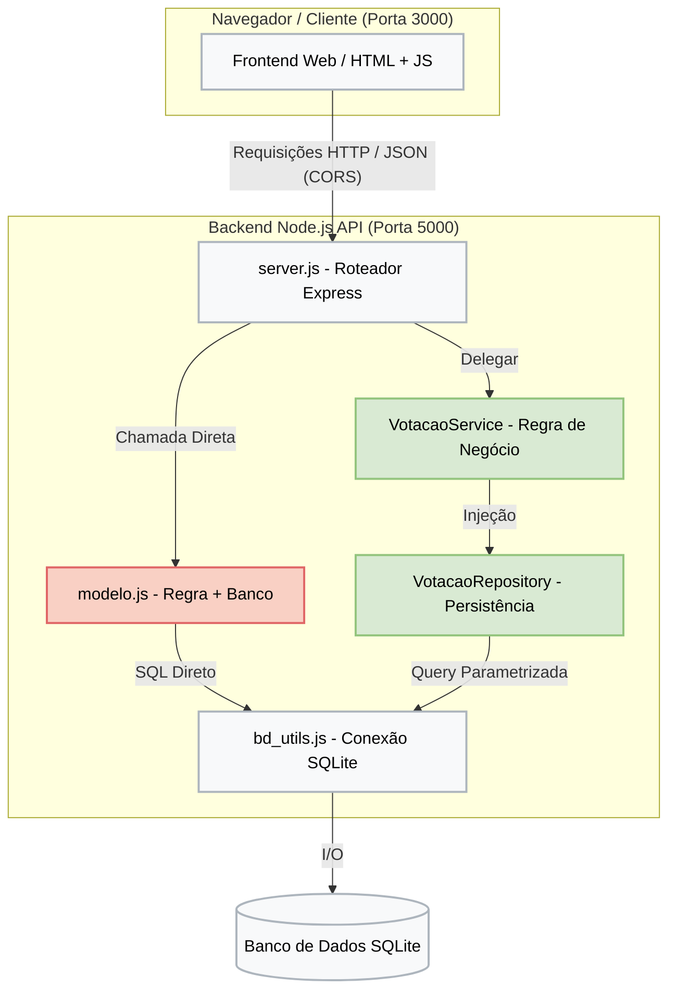

# Análise Arquitetural 

O sistema ESM Forum segue o estilo **Cliente-Servidor Desacoplado**:

- **Frontend (Cliente):** Aplicação Web executada na porta `3000`, responsável pela interface do usuário e captura de interações.
- **Backend (Servidor API):** Monolito Node.js executado na porta `5000` (`server.js`), fornecendo os endpoints REST.

A comunicação entre o cliente (porta 3000) e o backend (porta 5000) ocorre exclusivamente via HTTP/JSON, exigindo a habilitação de CORS no servidor para permitir chamadas cross-origin.

Internamente, o backend possui uma arquitetura de código Híbrida:
- **Módulo Legado (Duas Camadas):** As rotas de perguntas e respostas (`server.js`) acessam diretamente o `modelo.js`, que mistura validação de negócio e queries SQL sem separação clara.
- **Módulo Modernizado (Três Camadas):** A rota de votação foi isolada com separação estrita de responsabilidades (`server.js` -> `VotacaoService` -> `VotacaoRepository`).

## Diagrama

