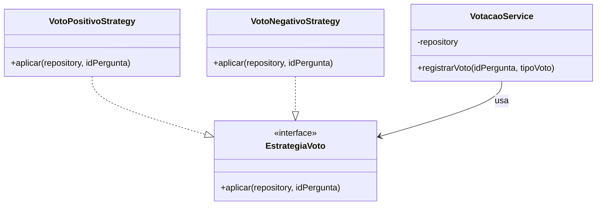
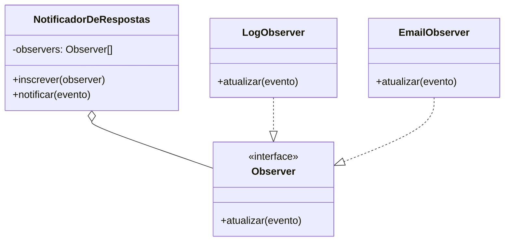
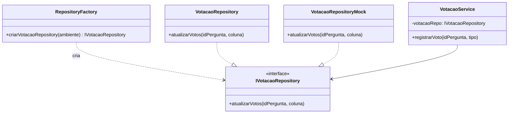

## Proposta de Aplicação de Padrões de Projeto

## 1. Strategy 

Na implementação inicial do sistema de votação, foi criado um objeto de lookup: `estrategiasDeVoto` (`{ up: 'upvotes', down: 'downvotes' }`), para validar o tipo recebido e descobrir qual coluna atualizar no banco. Porém é só uma tabela, sem polimorfismo, e se um novo tipo de interação precisar ser adicionado no futuro, será preciso mexer em código que já estava pronto, que viola o Princípio Aberto/Fechado.

Usando o Strategy, cada tipo de voto vira uma classe própria, todas seguindo a mesma interface. Daí, adicionar um novo tipo de voto não interfere no que já existe.

### Solução

Uma interface `EstrategiaVoto` define o método `aplicar(repository, idPergunta)`. Cada tipo de voto vira uma classe concreta: `VotoPositivoStrategy` e `VotoNegativoStrategy`, que sabe qual coluna atualizar e delega para o `VotacaoRepository` já existente. O `VotacaoService` só busca a estratégia certa num mapa `tipo -> estratégia` e chama `.aplicar()`, sem precisar conhecer o nome da coluna de cada tipo de voto.

### Diagrama


### c) Exemplo de código

```javascript
class EstrategiaVoto {
  aplicar(repository, idPergunta) { throw new Error('não implementado'); }
}

class VotoPositivoStrategy extends EstrategiaVoto {
  aplicar(repository, idPergunta) {
    return repository.atualizarVotos(idPergunta, 'upvotes');
  }
}

class VotoNegativoStrategy extends EstrategiaVoto {
  aplicar(repository, idPergunta) {
    return repository.atualizarVotos(idPergunta, 'downvotes');
  }
}

const estrategias = {
  up: new VotoPositivoStrategy(),
  down: new VotoNegativoStrategy()
};

class VotacaoService {
  constructor(repository) {
    this.repository = repository;
  }

  registrarVoto(idPergunta, tipoVoto) {
    const estrategia = estrategias[tipoVoto];
    if (!estrategia) throw new Error("Tipo de voto inválido. Use 'up' ou 'down'.");
    return estrategia.aplicar(this.repository, idPergunta);
  }
}
```

---

## 2. Observer

Quando alguém cadastra uma resposta (`cadastrar_resposta` em `modelo.js`), hoje nada mais acontece além de salvar no banco. Porém poderia ser implementado algumas outras ações, como: avisar o autor da pergunta, atualizar um contador em tempo real, registrar um log de auditoria, e cada uma dessas ações é um interesse diferente, que não deveria ficar misturado dentro da função que cadastra a resposta.

O Observer resolve isso permitindo que vários "interessados" se inscrevam para serem avisados quando o evento "nova resposta" acontecer, sem que `modelo.js` precise conhecer cada um deles.

### Solução

Um objeto `NotificadorDeRespostas` (o *subject*) mantém uma lista de observadores e expõe `inscrever(observer)` e `notificar(evento)`. Classes como `LogObserver` e `EmailObserver` implementam a interface comum `Observer`, com o método `atualizar(evento)`. Depois de salvar a resposta no banco, `cadastrar_resposta` só chama `notificador.notificar(...)`.

### Diagrama


### c) Exemplo de código

```javascript
class NotificadorDeRespostas {
  constructor() { this.observers = []; }
  inscrever(observer) { this.observers.push(observer); }
  notificar(evento) { this.observers.forEach(o => o.atualizar(evento)); }
}

class LogObserver {
  atualizar(evento) { console.log('Nova resposta registrada:', evento); }
}

const notificador = new NotificadorDeRespostas();
notificador.inscrever(new LogObserver());

function cadastrar_resposta(id_pergunta, texto) {
  const params = [id_pergunta, texto];
  const result = bd.exec('INSERT INTO respostas (id_pergunta, texto) VALUES(?, ?) RETURNING id_resposta', params);
  notificador.notificar({ id_pergunta, texto });
  return result.lastInsertRowid;
}
```

---

## 3. Factory 
Com o `server.js` criando o repositório hardcoded (`new VotacaoRepository(bd)`), acoplando o servidor a uma implementação concreta de banco, fica difícil trocar o banco de dados e realizar testes automatizados.

Com a Factory, em vez do `server.js` decidir qual implementação usar, ele pede para uma fábrica, que decide isso de acordo com o ambiente.

### Solução

Uma `RepositoryFactory` com o método `criarVotacaoRepository(ambiente)` devolve a implementação de `VotacaoRepository` ou `VotacaoRepositoryMock` para testes, e ambas seguindo a mesma interface `IVotacaoRepository`. O `server.js` passa a chamar só a fábrica, ignorando a implementação.

### Diagrama


### c) Exemplo de código

```javascript
class RepositoryFactory {
  static criarVotacaoRepository(ambiente) {
    if (ambiente === 'teste') return new VotacaoRepositoryMock();
    return new VotacaoRepository(bd);
  }
}

const votacaoRepo = RepositoryFactory.criarVotacaoRepository(process.env.NODE_ENV);
const votacaoService = new VotacaoService(votacaoRepo);
```